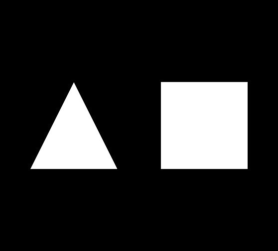
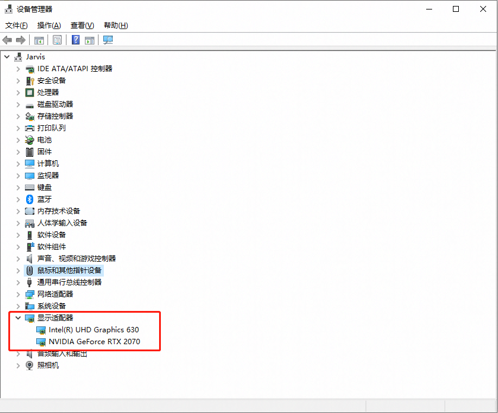
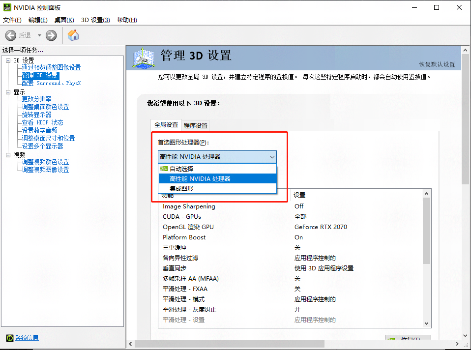
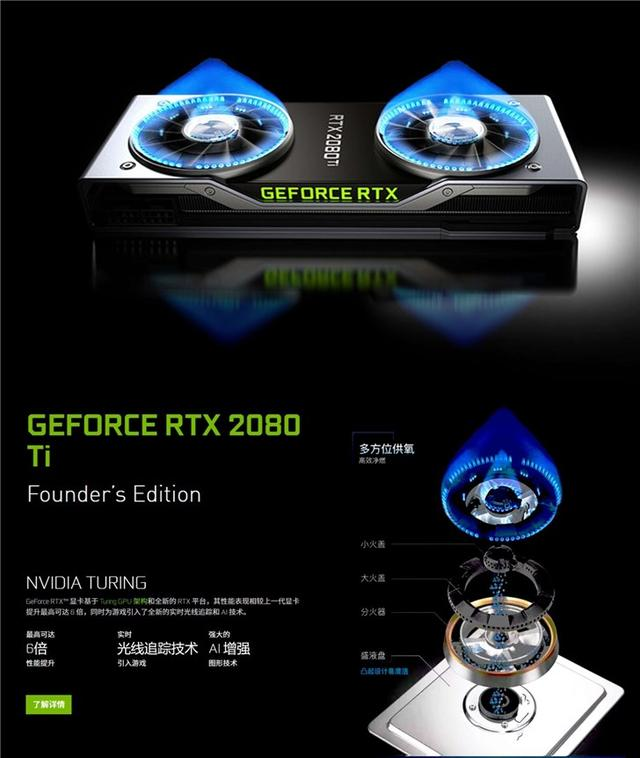
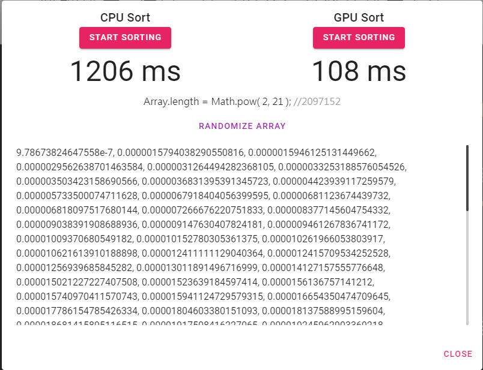

# Lesson1 三角和方块的故事

## 教程说明

欢迎来到 LearningWebGPU 教程，本教程改写自原本的 LearningWebGL.com 的 WebGL 入门教程，而后者则是改编于经典的 Nehe 的 OpenGL 教程。在开始教程前，有一些大家需要知道的事情：

1. 目前 WebGPU 仍然处于草稿阶段，所有的 API 接口可能会在未来发生变化。

2. 目前浏览器对于 WebGPU 的实现和支持仍处于实验阶段，可能会发生一些因为浏览器实现导致的 Bug 或错误；另外，开启浏览器的试验功能可能会降低浏览器的安全性，所以你不应该使用学习 WebGPU 开发的浏览器作为主力浏览器，例如请不要在这个浏览器中浏览、输入个人隐私信息、不要进行网页支付等。

3. 考虑到 WebGPU 正式投入生产环境应该是数年后的事情，所以本教程中将会使用大量新的 ECMA Script 的新特性，这些特性可能并不被当下的浏览器和 JavaScript 引擎所支持。

4. 本系列的教程是针对那些已经具备相应编程知识但没有实际 3D 图形经验的人的；目标是让学习者创建并运行代码，并且明白代码其中的含义，从而快速地创建自己的 3D Web 页面。

5. 我编写这套教程是因为我在独立学习 WebGPU，所以教程中可能（非常可能）会有错误，所以还请风险自担。尽管如此，我还是会不断的修正 Bug 和改正其中的错误的，所以如果你发现了教程中的错误或其他任何改进建议，请在本教程的 Github 仓库的 Issue 页面提交。

在这节课中，我们将实现以下效果：



> 注意：本节课相当的长，建议分三天到一周的时间读完即可。

下面，让我们正式开始第 1 课的内容。

## 初始化 WebGPU

在上一节课中，我们成功获取了 WebGPU 的上下文。但是我们也提到过，尽管在 WebGL 中上下文是 JavaScript 和 GPU 交互的重要桥梁，几乎所有的 WebGL 接口都是通过上下文来实现的；但是在 WebGPU 标准中，由于摒弃了固定渲染管线，并且从理念和设计哲学上高度借鉴 DirectX 12、Vulkan、Metal 这三大现代图形标准，所以 WebGPU 的上下文将不再承担如此繁重的工作，而仅仅成为和 HTML `<canvas>` 元素交互的桥梁。所以，在这节课中我们将会迎来一些新朋友，它们和上下文一起，组成了 WebGPU 绘制的基础环境。

打开 `app.ts` 文件，我们发现代码比上节课多了很多。如果你之前没有接触过 WebGL 原生 API，会认为如此多的的代码只为了画一个三角形和一个正方形，是不是有点过于[复杂](https://www.weibo.com/1657422865/zz19IFEfc?type=comment#_rnd1577769550951)；相反，如果你接触过 WebGL 或者学习过本课程的 WebGL 版本，那么你应该早已习以为常。事实上，相比 WebGL 的一次完整绘制流程，WebGPU 在概念和代码的复杂度上，都要降低很多了。

首先，我们可以看到，我们从依赖中引入了一个新的模块，叫做 `glslangModule`。

```typescript
import glslangModule from '@webgpu/glslang/dist/web-devel/glslang.onefile';
```

如果你还记得上一课中，我们曾经提起过，现时的 WebGPU 实际上发生了分裂，一派以 Apple 为代表的使用基于文本的 WSL 语言作为着色器语言，另一派以 Google 为代表的使用 GLSL 4.5 并编译成二进制的 SPIR-V 作为着色器语言。本套教程正是基于后者的，所以这个 `glslangModule` 就是用来把 GLSL 4.5 编译成 SPIR-V 的，编译过程中使用了 WebAssembly。

然后，相比上一课我们的 `App` 类只有一个公共成员 `canvas`，而这一课我们突然拥有了包括 `adapter`、`device`、`swapChain` 在内的许多其他成员。我会在下文中详细解释每个成员的作用。

接下来，我们的 `CreateCanvas()` 函数没有发生任何变化，但是 `InitWebGPU()` 函数发生了剧烈变化。下面让我们慢慢来看这个函数。

首先，我们在声明函数时，为 `InitWebGPU()` 函数加入了 `async` 关键字，用于表示这是一个异步函数。

```typescript
    public async InitWebGPU() {
```

### GPUAdapter 适配器

然后，我们初始化了一个叫做 `GPUAdapter` 的东西。

```typescript
    public adapter: GPUAdapter;
```

```typescript
        this.adapter = await navigator.gpu.requestAdapter( {

            powerPreference: 'high-performance'

        } );
```

`GPUAdapter` 的中文名字叫做**适配器**，如果你使用的是 Windows 操作系统，你可以打开设备管理器，找到你的显卡硬件那一栏，你可以看到上面写的是并不是什么显卡之类的字样，而是**显示适配器**。



*图为 Windows 10 操作系统中设备管理器界面中的显示适配器。*

是的，这里的 `GPUAdapter` 就是显示适配器的意思，也就是我们通常所说的**显卡**。

> 一个***适配器***代表了操作系统中一个 WebGPU 的实现。每个适配器标志着一个硬件加速器（例如 GPU 或 CPU）实例和一个浏览器在该硬件加速器之上对 WebGPU 的实现。
> 
> —— 摘自 [WebGPU 标准](https://gpuweb.github.io/gpuweb/#adapters)

以上就是 WebGPU 标准原文中对适配器的定义。这里有个很奇怪的地方，我们一直在说 GPU 的事情，为什么突然冒出了个 CPU 呢？

原因是，事实上在 GPU 被发明出来之前，大部分的图形工作都是使用中央处理器，也就是由 CPU 来承担的，在现代图形应用中，我们依然可以找到很多的应用程序在使用 CPU 绘制图形，只不过我们现在给它取了一个更好听的名字，叫做“软件渲染器”或者“软件加速”。

举个例子来说，例如和我们平常在家使用的台式机不一样，在服务器环境中，通常是没有一台硬件显示器使用 HDMI 或者 DP 接口的线缆插入到显卡的对应插槽来输出用户界面的；大多数服务器用户或开发者是使用 SSH 等命令行方式，或者远程桌面的方式来操控服务器的。

在这种情况下，操作系统并不会初始化 DirectX、Vulkan、OpenGL 之类的图形 API。没有了这些接口，应用程序自然无法使用 GPU 硬件加速的图形绘制，于是在这种情况下，软件渲染器就派上了大用场。


*图为 Autodesk 3Ds Max 在没有硬件加速的情况下，使用 Nitrous Software Renderer 来渲染 3D 视口。*

所以在 WebGPU 的标准中，特别注明了下面这样一段话。

> 注意：一个适配器可以是物理显示适配器（GPU），但它也可以是一个软件渲染器。返回的适配器对象可以指向不同的物理适配器，或者指向在该物理适配器之上不同的浏览器代码路径或者不同的操作系统驱动。应用程序可以同时使用多个适配器（通过 `GPUAdapter` 接口）（即使有些适配器是不可用的），两个不同的适配器接口对象可以代表同一块物理适配器配置的不同实例（例如，如果在某个 GPU 被重置，或者断开连接又重新连接的情况下）。

回到代码，我们使用的是 `navigator.gpu.requestAdapter()` 接口来获取的适配器。根据 WebGPU 标准，浏览器会在页面主线程和 Web Worker 的`navigator` 这一全局对象下同时增加一个名为 `gpu` 的只读属性。

> *`gpu`* 对象定义了 `navigator.gpu` 接口，它是 WebGPU 的入口。该对象暴露了 `requestAdapter()` 方法，用于获取适配器。
> 
> —— 摘自 [WebGPU 标准](https://gpuweb.github.io/gpuweb/#gpu-interface)

这个方法是一个异步函数，如果成功将返回一个 resolve 的 `Promise<GPUAdapter>` 对象；如果获取失败，将会返回一个 reject 的 `Promise<DOMException("OperationError")>` 对象。

这个方法接受一个类型为 `GPURequestAdapterOptions` 的参数，用于告诉浏览器，我们要获取一个什么样的显示适配器。

这个选项在目前主要是为桌面平台的笔记本设备服务的。

在当前大部分的 X86 架构的桌面电脑上，实际上一般都会有两个 GPU。一个是由中央处理器 CPU 提供的 GPU 部分，例如 Intel 品牌大部分的 CPU 和 AMD APU 系列都会提供一个功能相对完备但性能较弱的 GPU 硬件处理单元；另一个则是通常安装在主板 PCI-Express 插槽上的独立显卡。

前者就是我们通常俗称的“核显”、“板载显卡”或“集成显卡”，后者我们则叫做“独显”。

你可以在上面那张 Windows 设备管理器的截图上看到，我的笔记本有两个显示适配器，一个是 Intel UHD Graphics 630，也就是核显；另一个是 NVIDIA Geforce RTX 2070，也就是独显。

在台式机上实际上也存在同样两个 GPU，但是一般我们会在装机时，通过在 BIOS 中的设定，设置为只使用独立显卡。

一般来说，独立显卡可以提供更高的性能，但是同时会带来更高的耗电，并导致散热系统硬件的负担加重，在使用风冷的电脑上，会让风扇转速增加，带来额外的噪音，并导致设备续航时间下降；与之相对的是，集成显卡虽然性能较弱，但是在耗电上却极具优势，可以延长设备的续航时间。

在 Windows 操作系统的笔记本电脑上，你可以通过显卡的控制面板，来选择默认使用哪个 GPU 和为某个应用程序指定其使用的 GPU。一般来说，操作系统会自动判断应用程序的类型，为桌面绘制和一般应用程序（例如文字处理程序、聊天软件等）启用集成显卡，为游戏启用独立显卡。



*图为 NVIDIA 控制面板中选择默认 GPU 的界面*

回到 WebGPU 的话题，同样我们在请求适配器的时候，也可以根据当前应用的具体情况，通过 `GPURequestAdapterOptions` 参数，请求不同的显示适配器。

目前 `GPURequestAdapterOptions` 参数只有一个可选字段，就是 `powerPreference`，这个字段顾名思义就是耗电选项，它的可选值是一个名为 `GPUPowerPreference` 的枚举值。

```c
enum GPUPowerPreference {
    "low-power",
    "high-performance"
};
```

这个枚举类型有两个值：一个是 `"low-power"` 代表低耗电；另一个是 `"high-performance"` 代表高性能。

在 WebGPU 标准中，特别注明了应该在什么情况下使用不同的适配器。

> 注意：通常来说，如果内容不受绘制性能禁锢，应当使用低耗电的显示适配器；例如，如果每秒只渲染一帧，或者只使用简单的着色器绘制简单的几何体，或者 HTML `canvas` 元素的尺寸非常小。我们鼓励开发者在内容允许的情况下使用低耗电的显示适配器，因为它可以显著的改善移动设备的续航能力。
>
> 注意：如果选择了高性能的显示适配器，开发者应当注意，系统有可能基于省电的原因，迫使由此适配器创建的设备强制丢失。只有在开发者相信是绝对需要的情况下，才应当选择高性能的显示适配器，因为它会显著的降低移动设备的续航时间。
>
> —— 摘自 [WebGPU 标准](https://gpuweb.github.io/gpuweb/#adapter-creation)

所以，当我们未来在生产环境中，可以自由的根据应用的不同情况，来选择不同的显示适配器，这也是在 WebGL 中做不到的。

根据我的 WebGL 开发经验，Intel 系列核显的驱动经常会出问题，所以通常我会在显卡控制面板中设置优先使用高性能显卡，也就养成了这个习惯，所以在本套教程中，我尽管**不应该**，但还是选择使用了高性能的显示适配器。

好了，关于显示适配器的话题就到这里告一段落了。

不对，等等！如果一台电脑有三个显卡呢？我指的不是使用两块 NVIDIA 显卡做 [NVLink](https://zh.wikipedia.org/wiki/NVLink) 或者 [SLI](https://zh.wikipedia.org/wiki/NVIDIA_SLI)，也不是 AMD 显卡的[交火（CrossFire）技术](https://zh.wikipedia.org/wiki/AMD_CrossFire)，而是我给我的笔记本插入了一个外置显卡钨，里面安装了一个 NVIDIA Geforce RTX 2080Ti 显卡，这时候我的电脑有了三个显卡，一个核显，两个独显，甚至外接的独显比我笔记本电脑本身的独显还要好。

这时候两个独显的配置同为 `"high-performance"`，当我请求使用高性能显示适配器的时候，WebGPU 实现将会为我返回哪个显卡呢？

### glslang

接下来，我们直接执行了从 `@webgpu/glslang` 模块引入的 `glslangModule()` 函数，这也是一个异步函数。

```typescript
        this.glslang = await glslangModule();
```

其主要作用是初始化 glslang 模块，方便后续对 GLSL 语言源代码的编译。

你如果感兴趣其中的运作机制，可以直接参考 glslang 的[源代码](https://github.com/kainino0x/-webgpu-glslang)。

### GPUDevice 设备

下面，我们利用刚刚获得的适配器对象，来获取了一个称为 `GPUDevice` 的对象。

```typescript
    public device: GPUDevice;
```

```typescript
        this.device = await this.adapter.requestDevice();
```

> ***设备***是一个适配器逻辑上实例化的过程，通过它创建了内部对象（internal objects）。它可以在多个 agent 中共享（例如[专用 Worker](https://developer.mozilla.org/zh-CN/docs/Web/API/Web_Workers_API/Using_web_workers)）。
> 
> —— 摘自 [WebGPU 标准](https://gpuweb.github.io/gpuweb/#devices)

你可以把 GPU 设备想象成适配器提供的具体的硬件实例，例如显存，利用设备你可以在显存中创建缓存（Buffer）、纹理（Texture）、渲染管线（Pipeline）、着色器模块（Shader Module）等，对显示适配器中的设备进行具体操作。

或者用一个不太恰当的比喻，GPU 适配器好比是你得到的一块显卡，它很大，像一个燃气灶，上面有好多东西，但很多东西是你不需要的，比如上面的风扇、炫酷的 LED 灯、各种线缆插槽、还有那块挡板铁片、那些螺丝，这些东西对你做 GPU 绘制是没有用的。什么是有用的呢？比如显存！比如 GPU 芯片！比如顶点处理单元！而 GPUDevice 就好比是适配器上那些对你开发有用的那些硬件**设备**集合。




*网友吐槽 NVIDIA 显卡看起来像燃气灶*

那么标准中提到的“内部对象（internal objects）”指的又是什么呢？

> 内部对象是指不对外暴露的概念上的 WebGPU 对象。内部对象会跟踪一个 API 对象的状态，并掌握它所有依赖的实现。如果某个特定的内部对象状态可以在多个 agent 中并行改变，这些改变都会遵循所有 agent 的原子操作原则。
>
> —— 摘自 [WebGPU 标准](https://gpuweb.github.io/gpuweb/#webgpu-internal-objects)

好的，问题又来了？`agent` 又是个啥东西？

熟悉 ECMA Script 标准的人，应该知道 ES 中也有个 `agent` 的概念，在这里，它们俩基本上指的是同一个事情。

> 注意：“agent” 指的是 JavaScript “线程”（例如主线程或者 Web Worker 线程）。
>
> —— 摘自 [WebGPU 标准](https://gpuweb.github.io/gpuweb/#webgpu-internal-objects)

也就是说 GPU 设备是可以在多个线程中共享使用的，如果浏览器允许多个线程同时操作同一个 GPU 设备，那么这些操作要遵循原子操作原则。

那什么是原子操作呢？

> **原子操作**
>
>多个共享内存的线程能够同时读写同一位置上的数据。原子操作会确保正在读或写的数据的值是符合预期的，即下一个原子操作一定会在上一个原子操作结束后才会开始，其操作过程不会中断。
> 
> —— 摘自 [MDN Atomics 条目](https://developer.mozilla.org/zh-CN/docs/Web/JavaScript/Reference/Global_Objects/Atomics)

好了，相信以上一层套一层的解释可以帮助你很好的理解什么是 `GPUDevice`。

我们是通过 `adapter.requestDevice()` 方法获取到 GPU 设备的，尽管我们没有传参，但实际上这个函数是可以接受一个类型为 `GPUObjectDescriptorBase` 的参数的。

类似于获取 GPU 适配器，我们在获取 GPU 设备的时候，也可以指定我们需要什么样的设备。

`GPUObjectDescriptorBase` 有两个字段，一个是 `extensions`，用于指定当前绘制需要的扩展；另一个是 `limits`，用于指定获取最大支持什么样能力的设备。

在 WebGL 中，因为 WebGL 1.0 标准本身的原因，许多实用的绘制接口和功能实际上都是通过扩展的形式实现的，例如浮点纹理等。

在 WebGPU 中，因为目前仍处早期阶段，所以并没有太多的扩展。目前 `extension` 的可选值只有一个：

```c
enum GPUExtensionName {
    "anisotropic-filtering"
};
```

而 `limits` 有以下选项可供选择：

```c
dictionary GPULimits {
    unsigned long maxBindGroups = 4;
    unsigned long maxDynamicUniformBuffersPerPipelineLayout = 8;
    unsigned long maxDynamicStorageBuffersPerPipelineLayout = 4;
    unsigned long maxSampledTexturesPerShaderStage = 16;
    unsigned long maxSamplersPerShaderStage = 16;
    unsigned long maxStorageBuffersPerShaderStage = 4;
    unsigned long maxStorageTexturesPerShaderStage = 4;
    unsigned long maxUniformBuffersPerShaderStage = 12;
};
```

其中规定了获取到的设备的能力上限，`=` 后面是默认值。在这里需要注意的是，一旦你使用了 `limits` 参数，那么你所设置的能力上限最高不能超过 GPU 适配器本身的上限；而且，即使 GPU 适配器支持更高的能力上限，但你只能遵守你在参数中设置的上限。

例如 GPU 适配器支持最多绑定 8 个 Group, 而你只要求了 4 个，那么你最多也只能绑定 4 个。

`GPUDevice` 是我们操作 GPU 的核心接口，我们将在后面陆续讲解它的各种方法。

好了，理论上，按照 WebGPU 标准的概念，在获得 `GPUAdapter` 和 `GPUDevice` 之后，我们就已经完成了 WebGPU  的初始化工作。但是实际上，我们还有很多工作要做。让我们继续浏览代码。

### GPUCanvasContext 上下文

接下来，我们遇到上上节课熟悉的代码，我们用 `<canvas>` 元素请求了一个 WebGPU 的上下文。

```typescript
        this.context = <unknown>this.canvas.getContext( 'gpupresent' ) as GPUCanvasContext;
```

### GPUSwapChain 交换链

然后，我们使用这个上下文设置了一个叫做 `GPUSwapChain` 的东西。

```typescript
    public swapChain: GPUSwapChain;
```

```typescript
        this.swapChain = this.context.configureSwapChain( {

            device: this.device,

            format: this.format,

            usage: GPUTextureUsage.OUTPUT_ATTACHMENT | GPUTextureUsage.COPY_SRC

        } );
```

与 `GPUSwapChain` 交互是目前 WebGPU 的上下文的唯一工作，这也正是为什么我们反复提到的 WebGPU 和 WebGL 最大的区别，WebGPU 的上下文不再作为 JavaScript 和 GPU 交互的唯一桥梁。

那么什么是 `GPUSwapChain` 呢？WebGPU 标准中并没有提到，这一是因为 SwapChain 已经成为现代图形标准中的普世概念，在 D3D12、Vulkan 中都存在 SwapChain 对象。

SwapChain 的中文名字叫做**交换链**，它的工作主要是用来向显示器输送绘制完毕的图像。为了更好的理解交换链的作用，我们把它与 WebGL 中的帧缓冲（Frame Buffer）做对比。

显示器的显示和显卡的渲染是并行执行的，显示器会根据自身硬件的刷新率（例如大部分液晶显示器的刷新率是 60 Hz，一些高端的电竞显示器可以达到 144 Hz），按时向显卡索要用于显示在显示器上的图像，储存这个图像的缓冲就是我们所说的帧缓冲。

在 WebGL 中，我们拥有一个默认的帧缓冲（Default Frame Buffer），如果不做任何其他操作，那么当我们执行绘制命令（draw call）的时候，所有绘制的内容都会填充到默认帧缓冲中，而显卡会把这个默认的帧缓冲直接提交给显示器，並显示在显示器中。

但是这种显示方式会造成一个问题，当显示器已经显示完毕当前的图像，向显卡索要下一帧的图像时，如果渲染还没有完成，显示器就会取走一张还没有绘制完毕的图像，这张图像的一部分是当前渲染的那些内容，剩下的还是上一帧的内容，这就会导致图像的撕裂。就好比考试的时候，不管你答没答完卷，到点了老师都会收走卷子。

所以在成熟的 WebGL 应用中，开发者会创建一个额外的后台帧缓冲，当后台帧缓冲渲染完毕的时候，用它和前台帧缓冲进行**交换（Swap）**，提交给显示器，然后使用空闲出来的那个帧缓冲继续渲染，使用这样的机制可以确保显示器取走的永远都会是一个渲染完毕的图像。这种交换机制并不会真的进行数据交换，而仅仅是交换了两个帧缓冲在显存中的指针，所以不会带来性能上的消耗。在这种显示方式下，我们的渲染频率永远不会超过显示器的刷新频率。

但是这样又会导致另外一个问题，如果我们的渲染速度很快，那么当后台帧缓冲都已经绘制完毕的时候，显示器还没显示完前台的那个帧缓冲，也就是说显示器还没有来取下一帧图像，这样后台帧缓冲就会排队等待被显示器取走，而这时我们的渲染引擎就会停止工作，因为所有的帧缓冲都已经被占满了，已经没有地方去绘制了。就好比停车场车位已满，如果不出去一辆车，空出一个车位，你就没法开进去。

所以，开发者会再创建一个后台帧缓冲，这也就是所谓的“三重缓冲”。喜欢玩游戏的读者应该对这个概念并不陌生，它经常出现在游戏的图像设置中，用于降低输入延迟。三重缓冲保证了渲染工作永不停歇，可以充分利用显卡的硬件性能，但是也会出现性能浪费的情况，在这时用户可以选择手动限制帧率。

以上是 WebGL 中的帧缓冲的概念，通过双重缓冲和三重缓冲的显示机制的阐述，应该可以帮助你理解交换链的概念。类似于多个帧缓冲的机制，你可以把交换链理解为一系列图像的**队列**，显示器永远从该队列的最前面取走图像，显示完毕后返回给该队列。

在现代图形标准中，例如 Vulkan 中，你可以精确设置交换链的交换策略。例如当有多个帧缓冲在排队等待显示器取走的时候，可以根据应用的类型，选择不同的策略。比如说，如果是视频应用，我们一般希望按照顺序输出每帧图像；如果是游戏，我们则希望始终输出最新被渲染出的那一帧图像。

在 WebGPU 中，也借鉴了现代图形标准中交换链的概念，用于和显示器进行交互，所以这也是它为什么和上下文绑定在一起的原因，因为上下文是通过 `<canvas>` 元素获得的，而我们最终显示输出的地方，正是这块 `<canvas>` 元素。

但是和在 Vulkan 中不同，目前我们无法对 WebGPU 中的交换链做更多细致的操作，因为它现在只有一个接口，就是获取当前图像。

```typescript
interface GPUSwapChain {
    GPUTexture getCurrentTexture();
};
```

所以，尽管我们了解很多交换链的用途，但是现在我们除了获取当前图像以外啥都干不了，所以就当它是个往 `<canvas>` 上输出图像的东西好了。

反过来想，如果我们的内容不需要绘制到 `<canvas>` 上，不需要显示在显示器上，是不是我们就不需要创建交换链了？

答案是肯定的。

回到 WebGL 的时代，如果我们想使用 WebGL 渲染一张图片，即使不需要显示在屏幕上（例如只是从其中读取像素数据或者提供给用户下载），我们也要新建一个 `<canvas>` 元素，然后使用 `gl.readPixels()` 或者 `canvas.toDataURL()` 函数取出其中的内容，因为没有 `<canvas>` 我们就无法获取 WebGL 上下文，也就无法进行 WebGL 的绘制。

但是在 WebGPU 中，如果我们只是纯粹想要获取显卡绘制的图像数据，就没有必要新建一个 `<canvas>` 元素了。例如视频压缩应用。

让我们回到代码中。

```typescript
        this.swapChain = this.context.configureSwapChain( {

            device: this.device,

            format: this.format,

            usage: GPUTextureUsage.OUTPUT_ATTACHMENT | GPUTextureUsage.COPY_SRC

        } );
```

通过 WebGPU 上下文设置交换链需要提供三个参数选项，分别是 `device`、`format` 和 `usage`。

- `device` 是指 `GPUDevice`，也就是上面我们获得的 GPU 设备。

- `format` 是指图像的格式。我们最常用的格式是使用 rgba 来代表一个像素的色彩，分别是红原色（red）、绿原色（green）、蓝原色（blue）和透明度（alpha），并且每个颜色我们使用 8 位值来表述，即 0 到 255 的整数，对于透明度则使用 0 到 1 的浮点数来表述；为了统一数字格式，我们通常会将颜色归一化，也就是把颜色的数值从 0 到 255 的区间归一到 0 到 1 的区间，这样我们就可以用 4 个 0 到 1 之间的浮点数来表示一个像素的色彩了，而不是三个整数和一个浮点数。在这里我们使用的格式是 `'bgra8unorm'` 其中 `bgra` 代表了三原色和透明度，`8` 代表使用 8 位值，`unorm` 代表 unsigned normalized 即无符号归一化的。除了 `'bgra8unorm'`，WebGPU 标准还规定了其他很多的图像格式，同时这些图像格式也是 WebGPU 中纹理的格式，你可以在[这里](https://gpuweb.github.io/gpuweb/#texture-formats)找到所有的格式。如果你不知道显示系统支持什么样的格式，可以通过 `context.getSwapChainPreferredFormat( device: GPUDevice )` 接口来获取它。

```typescript
        this.format = await this.context.getSwapChainPreferredFormat( this.device );
```

- `usage` 是指图像的用途，对于交换链，WebGPU 规定它的默认值是 `GPUTextureUsage.OUTPUT_ATTACHMENT`，也就是向外输出的图像。

最后，需要注意的是，当我们执行 `context.configureSwapChain()` 命令时，我们会销毁所有之前设定的交换链，包括所有这些交换链制造的图像。

好了，到此为止我们正式完成了 `InitWebGPU()` 这个函数的旅程。总结一下就是，根据 WebGPU 标准，初始化 WebGPU 需要获取 `GPUAdapter` 和 `GPUDevice`；如果你的应用程序不需要将图像绘制到屏幕上，那么到此为止你就初始化完毕了；相反如果你的应用程序需要向 HTML `<canvas>` 元素上绘制，那么你还需要获取一个交换链用于图像输出。

## 设置渲染通道

这里是本节课的一个分界线，在这之前我们所做的都是基础的初始化工作，也就是说之前我们创建的所有对象 `GPUAdapter`、`GPUDevice`、`GPUSwapChain`，我们都可以在 WebGPU 应用中一直持续的使用他们，如果没有特殊情况，我们一般不需要重新设置获取它们，也就是说它们的生命周期将伴随整个应用；但是在这之后我们所进行的工作和所获取到的 GPU 对象实例，我们可以根据实际情况，在每一帧的绘制中销毁它们或者重新获取新的实例，也就是说，它们的生命周期可能仅仅持续一帧的时间。

### GPUCommandEncoder 指令编码器

接下来，依然是 `app.ts`，让我们进入到一个全新的函数 `InitRenderPass()`。

`RenderPass` 的中文名字叫做“渲染通道”，你可以把他理解为我们用画笔画画时的一个工序，例如我们会先画草稿构图，然后绘制细节和光影，最后上色，这其中每个环节工序都可以认为是一个渲染通道。在渲染通道中，我们会进行具体的绘制工作，每个渲染通道结束，我们都会得到一幅图像。在复杂的 3D 应用中，最终呈现在显示器上的图像，往往是多个渲染通道组合迭代的结果。但是在本课中，因为我们只是简单地绘制一个三角形和一个正方形，所以我们只需要一个渲染通道就可以了。

在这个函数的开始，我们初始化了一个叫做 `GPUCommandEncoder` 的东西。

在第 0 课中，我们曾提到过，WebGPU 和 WebGL 另一个不同就是，WebGPU 并不是基于某个已经实现的本地图形标准实现的，而是广泛借鉴了 D3D12、Vulkan 和 Metal 中的概念。例如上一节中讲到的交换链，就是来自于 D3D12 和 Vulkan，言外之意就是 Metal 中其实并没有交换链，Metal 把向显示器输送图像的工作交给了 MacOS 和 iOS 操作系统的 `NSView` 去实现。

而现在我们面对的这个 `GPUCommandEncoder` 概念，则是直接来源于 Metal；在 D3D12 和 Vulkan 中，类似的概念分别叫做 `GraphicCommandList` 和 `CommandBuffer`，只有在 Metal 中，它叫做 [`MTLCommandEncoder`](https://developer.apple.com/documentation/metal/mtlcommandencoder)

```typescript
    public commandEncoder: GPUCommandEncoder;
```

```typescript
        this.commandEncoder = this.device.createCommandEncoder();
```

和交换链一样，WebGPU 标准中并没有给出 `GPUCommandEncoder` 的定义，所以让我们看一下在 Metal 中的 `MTLCommandEncoder`。

`CommandEncoder` 可以叫做指令编码器，它的作用是把你需要让 GPU 执行的指令写入到 GPU 的指令缓冲区（Command Buffer）中，例如我们要在渲染通道中输入顶点数据、设置背景颜色、绘制（draw call）等等，这些都是需要 GPU 执行的指令，所以在创建渲染通道之前，我们必须先创建一个指令编码器。

除了在渲染通道中进行的 GPU 指令，我们还可以通过指令编码器直接操控 GPU 显存，例如将一个缓存拷贝到另外一个缓存，将一个纹理拷贝到另外一个纹理，或者交杂起来，将一个缓存拷贝到一个纹理，将一个纹理拷贝到一个缓存。

另外，我们还可以在指令编码器中设置 Debug 信息，方便开发调试。

最后，当所有的指令写入后，我们可以调用 `commandEncoder.finish()` 命令，结束这一编码器。

下面是 WebGPU 标准中规定的 `GPUCommandEncoder` 接口的 API 文档。

```typescript
interface GPUCommandEncoder {
    GPURenderPassEncoder beginRenderPass(GPURenderPassDescriptor descriptor);
    GPUComputePassEncoder beginComputePass(optional GPUComputePassDescriptor descriptor = {});

    void copyBufferToBuffer(
        GPUBuffer source,
        GPUBufferSize sourceOffset,
        GPUBuffer destination,
        GPUBufferSize destinationOffset,
        GPUBufferSize size);

    void copyBufferToTexture(
        GPUBufferCopyView source,
        GPUTextureCopyView destination,
        GPUExtent3D copySize);

    void copyTextureToBuffer(
        GPUTextureCopyView source,
        GPUBufferCopyView destination,
        GPUExtent3D copySize);

    void copyTextureToTexture(
        GPUTextureCopyView source,
        GPUTextureCopyView destination,
        GPUExtent3D copySize);

    void pushDebugGroup(DOMString groupLabel);
    void popDebugGroup();
    void insertDebugMarker(DOMString markerLabel);

    GPUCommandBuffer finish(optional GPUCommandBufferDescriptor descriptor = {});
};
```
###  GPURenderPassEncoder 渲染通道编码器

设置完指令编码器，我们就可以创建一个渲染通道了。

```typescript
        let renderPassDescriptor: GPURenderPassDescriptor = {

            colorAttachments: [ {

                attachment: this.swapChain.getCurrentTexture().createView(),

                loadValue: clearColor

            } ]

        }

        this.renderPassEncoder = this.commandEncoder.beginRenderPass( renderPassDescriptor );
```

我们使用 `commandEncoder.beginRenderPass()` 函数来开启了一个渲染通道。这个函数接受一个类型为 `GPURenderPassDescriptor` 的参数作为渲染通道的选项。

这个 `GPURenderPassDescriptor` 也是直接参考 Metal 标准制定的，你可以直接在 Apple 开发文档中找到它的表兄[`MTLRenderPassDescriptor`](https://developer.apple.com/documentation/metal/mtlrenderpassdescriptor)

```typescript
dictionary GPURenderPassDescriptor : GPUObjectDescriptorBase {
    required sequence<GPURenderPassColorAttachmentDescriptor> colorAttachments;
    GPURenderPassDepthStencilAttachmentDescriptor depthStencilAttachment;
};
```

根据 WebGPU 标准，这个参数有两个字段，一个是必填字段 `colorAttachments`，需要注意的是这是一个序列，对应到 JavaScript 中，也就说它应该是一个数组；另外一个是 `depthStencilAttachment`。

所谓的 `colorAttachments` 是指一个附加在当前渲染通道的数组，用于储存（或者临时储存）图像信息，我们通常只会把渲染通道的结果存成一份，也就是只渲染到一个目标中，但是在某些高级渲染技巧中，我们需要把渲染结果储存成多份，也就是渲染到多个目标上，这就是它为什么被设计成一个数组的原因；而 `depthStencilAttachment` 则是指一个附加在当前渲染通道用于储存渲染通道的深度信息和模板信息的附件。

在本节课中，我们不需要深度信息，因为本质上我们画的是两个二维图形，所以不需要处理深度、遮挡、混合这些事情。所以我们仅设置了 `colorAttachments`，在 WebGPU 标准中，它其中的每一个成员都被定义为叫做 `GPURenderPassColorAttachmentDescriptor`的类型。

```typescript
dictionary GPURenderPassColorAttachmentDescriptor {
    required GPUTextureView attachment;
    GPUTextureView resolveTarget;

    required (GPULoadOp or GPUColor) loadValue;
    GPUStoreOp storeOp = "store";
};
```

其中有两个必选字段，首先是 `attachment` 也就是在哪里储存当前通道渲染的图像数据；其次是 `loadValue`，它可以是某个加载操作（`GPULoadOp`）或者某个颜色（`GPUColor`），后者就是我们所说的背景颜色，类似对应于 WebGL 中的 `gl.clearColor`；最后有一个默认值为 `"store"` 的 `storeOp` 可选字段，是指储存时要执行的操作，也就是储存（`"store"`），而不是清除（`"clear"`）。

还剩一下一个可选字段 `resolveTarget` 用于多重采样，我们将在后面的课程中用到它，到时候我们再详细解释。

回到代码，我们声明了一个类型为 `GPURenderPassDescriptor` 的局部变量 `renderPassDescriptor`，用于描述我们即将开始的渲染通道。在其中我们只使用了一个颜色附件，并且没有使用深度和模板附件。在颜色附件中，我们指定把渲染结果储存在交换链的当前图像上，也就是 `this.swapChain.getCurrentTexture().createView(),` 。

`this.swapChain.getCurrentTexture()` 还比较好理解，就是获取当前的纹理图像，但为什么还要 `createView()` 呢？

我们用 JavaScript 中的类型化数组来类比，不管是 `Float32Array` 还是 `Uint16Array`，每一个类型化数组的背后都存在着内存中的一段缓冲区，也就是 `ArrayBuffer`；而 `ArrayBuffer` 是看不见闻不到的，如果你想查看 `ArrayBuffer` 中的东西，就需要把用类型化数组来表示它；我们知道，基于同一个 `ArrayBuffer` 可以建立不同类型的类型化数组，它们的数据虽然各不相同，但都是对同一个内存缓冲区的描述。

类似的，在 WebGPU 中 `Texture` 也就是图像也是代表着显存中的一个区域，如果想要对它进行操作，就需要创建这个纹理或者图像的视图，也就是 [`GPUTextureView`](https://gpuweb.github.io/gpuweb/#texture-view)。同样的，基于同一个 `GPUTexture`，使用不同的 `GPUTextureFormat`（和其他参数） 也能创建出不同的 `GPUTextureView`。

回到代码，然后我们使用 `InitRenderPass()` 函数传入的颜色参数，把它设定为背景颜色。我们希望这个参数符合 `GPUColorDict` 接口的规定，也就是前面听到过的 rgba 表示法。

```c
dictionary GPUColorDict {
    required double r;
    required double g;
    required double b;
    required double a;
};
```

最后，我们用这个渲染通道的描述变量，通过 `GPUCommandEncoder` 开启了一个新的渲染通道。

附赠内容：我们用 `renderPassEncoder.setViewport()` 设置了这个渲染通道的视口，这个函数基本上和 WebGL 中的 `gl.viewport()` 类似。

```typescript
        this.renderPassEncoder.setViewport( 0, 0, this.canvas.clientWidth, this.canvas.clientHeight, 0, 1 );
```
```c
    void setViewport(float x, float y,
                     float width, float height,
                     float minDepth, float maxDepth);
```

其中 `x` 代表视口的左下角水平坐标，一般是 0； `y` 代表视口的左下角的垂直坐标，一般是 0；`width` 是视口的宽度；`height` 是视口的高速；`minDepth` 是最小的深度值，一般是 0；`maxDepth` 是最大深度值，一般是 1。

当一个渲染通道被建立时，WebGPU 会默认创建一个视口，其 `x` 和 `y` 都是 0, `minDepth` 是 0， `maxDepth` 是 1，而 `width` 和 `height` 则被设定为这个渲染通道的渲染目标的尺寸。

所以，在本例中，我们的渲染通道的渲染目标是交换链的当前图像，交换链则是来源于 `<canvas>` 元素创建的 WebGPU 上下文，所以交换链的图像尺寸会被默认设置为 `<canvas>` 元素的 `width` 和 `height` 属性，所以实际上这条视口设置语句是不需要的，因为 WebGPU 会自动设置视口的默认值。另外要注意的是，默认交换链的图像尺寸是来自于 `<canvas>` 的 `width` 和 `height` 属性，而不是 `clientWidth` 和 `clientHeight`。所以这也是为什么我们在 `CreateCanvas()` 函数中要显式设定这两个属性的原因。

## 设置渲染管线

### GPURenderPipeline 渲染管线

下面我们要讲解的是一个代码行数很多的 `InitPipeline()` 函数，在这个函数中，我们创建了一个 `GPURenderPipeline`，也就是渲染管线，并把它设定在我们刚刚开启的那个渲染通道上。问题在于，创建渲染管线的函数需要一个参数，用于描述我们的渲染管线，但这个参数实在太复杂了，所以我们在 `InitPipeline()` 的前大半部分代码都用来组建这个参数了。

让我们耐心继续看下去。

终于，我们来到了渲染管线的部分，它是我们绘制前的最后准备工作。通常来说，你可以把渲染管线理解为工厂生产作业的流水线，它分为若干个步骤，经由这些步骤，最后可以生产出我们想要的东西。

在 WebGPU 中，`GPURenderPipeline` 是由 `GPUDevice` 创建的，並被设定在 `GPURenderPass` 上的。

```typescript
        this.renderPipeline = this.device.createRenderPipeline( { ... } )
```

```typescript
        this.renderPassEncoder.setPipeline( this.renderPipeline );
```

其中，`device.createRenderPipeline()` 函数接受一个类型为 `GPURenderPipelineDescriptor` 的参数，它用于具体描述渲染管线信息的，让我们来看看这个类型的定义。

```typescript
dictionary GPURenderPipelineDescriptor : GPUPipelineDescriptorBase {
    required GPUProgrammableStageDescriptor vertexStage;
    GPUProgrammableStageDescriptor fragmentStage;

    required GPUPrimitiveTopology primitiveTopology;
    GPURasterizationStateDescriptor rasterizationState = {};
    required sequence<GPUColorStateDescriptor> colorStates;
    GPUDepthStencilStateDescriptor depthStencilState;
    GPUVertexStateDescriptor vertexState = {};

    unsigned long sampleCount = 1;
    unsigned long sampleMask = 0xFFFFFFFF;
    boolean alphaToCoverageEnabled = false;
    // TODO: other properties
};
```

通过这个类型定义，我们基本可以了解到 WebGPU 中渲染管线的步骤。

#### `vertexStage` 和 `fragmentStage` | 顶点着色器和片元着色器

首先是必填字段 `vertexStage`，通俗的翻译大概是“顶点阶段”，浪漫一些的话可以称为“顶点的舞台”，也就是我们处理顶点数据的地方，对应于 WebGL 中的顶点着色器。

然后是可选字段 `fragmentStage`，也就是我们处理片元信息的地方，对应于 WebGL 中的片元着色器。所谓的片元，你可以简单的理解为“像素”，所以在 DirectX 等图形框架中，也被称为像素着色器。

你也许会问，到底什么是着色器？ 好吧，从 3D 图形学历史的角度来讲，它的确曾经扮演过和它名字一样的角色 —— 编译好的二进制程序告诉系统如何在绘制一个场景之前进行渐变或上色。但随着时间的推移，着色器开始渐渐扩展自己的应用范围，现在应当把它定义为编译好的二进制程序在绘制一个场景之前做任何想要做的事情。这的确非常实用，一是因为这些操作是在显卡中进行的，所以运行速度非常快；二是因为这些操作调用起来非常方便，即使在这种简单的实例中。

我们之所以在一个 WebGPU 的初级实例中引入着色器的概念（要知道在OpenGL中，到中级开发才会出现着色器的概念），是因为我们要使用着色器来进入 WebGPU 的渲染管线，并把一些**相对复杂**的运算交给显卡来进行，而不是在相对较慢的 JavaScript 中去进行这些运算。它是如此难以置信的实用，提高了我们的效率，所以我们值得花时间去学习和了解它。

为什么 GPU 的并行运算要快于 JavaScript？主要是计算架构的不同，GPU 中的运算是并行计算，而 CPU 则是顺序计算，对于相同的算法，即使我们不用 JavaScript 而是用 C++ 编写的程序依然要比 GPU 慢。比如我们可以想象，我有一张纸，要在上面戳出来 100 个洞，每排 10 个，一共 10 排；用 CPU 戳洞意味着我们要写一个循环命令，用一个锥子一个洞一个洞的戳，直到戳完；而用 GPU 戳洞的方式则是我们找到了一个布满 10 x 10 锥子的砧板，一下子戳到纸上，完活。

我们在这里做一个简单的评测。双调排序是一种可以并行计算的排序算法，我们用它和 JavaScript 中的 `Array.sort()` 方法做对比，对一个长度是 2 的 21 次幂的 32 位浮点数组进行排序。在我的台式机（Intel i7 6700K / NVIDIA Geforce GTX 970）上，对于相同的数组，GPU 并行计算只需要 108 毫秒，而 CPU 排序则需要 1206 毫秒。



所以，当你需要处理顶点数据的时候，应当尽量把复杂运算放到 GPU 的着色器中。

我们会在后面继续讲解着色器的概念，现在让我们接着看渲染管线的其他部分。

#### `primitiveTopology` 绘制模式

接下来是一个必填字段 `primitiveTopology`，它很好理解，就是我们需要 GPU 进行哪种模式的绘制。WebGPU 标准规定了以下几种模式：

```typescript
enum GPUPrimitiveTopology {
    "point-list",
    "line-list",
    "line-strip",
    "triangle-list",
    "triangle-strip"
};
```

在讲解每种模式之前，先假设我们有 6 个顶点，分别是 `v0`、`v1`、`v2`、`v3`、`v4`、`v5`。

- `point-list`：将在每个顶点坐标的位置绘制一个点。绘制结果是，我们将分别在每个点的位置上一共绘制出 6 个点。

- `line-list`：将使用每两个顶点作为起点和终点绘制一条线段，所以我们将绘制出 3 条线段，分别是 `[v0, v1]`、`[v2, v3]`、`[v4, v5]`。

- `line-strip`：将使用第 1 个和第 2 个的顶点作为起点和终点绘制一条线段，然后用线段把第 3 个顶点和第 2 个顶点连接起来，再用线段把第 4 个顶点和第 3 个顶点连接起来……以此类推，总是用下一个点和上一条线段的终点来绘制一条线段。所以我们将绘制出 5 条线段，分别是 `[v0, v1]`、`[v1, v2]`、`[v2, v3]`、`[v3, v4]`、`[v4, v5]`。

- `triangle-list`：将使用每三个顶点绘制一个三角形。所以我们将绘制出 2 个三角形，分别是 `[v0, v1, v2]` 和 `[v3, v4, v5]`。

- `triangle-strip`：类似于 `line-strip`，将使用接下来一个顶点和上一个三角形的最后两个顶点，绘制一个新的三角形。我们将绘制出 4 个三角形，分别是 `[v0, v1, v2]`、`[v1, v2, v3]`、`[v2, v3, v4]`、`[v3, v4, v5]`。

在本节课程的代码中，我们使用了 `triangle-list`，这也是大部分 3D 应用使用的模式，你可以尝试用其他值来代替它，看看画出的不同形状，以帮助你更好的理解 `GPUPrimitiveTopology`。

剩下的字段中，我们先只讲解本节课用到的部分。

#### `colorStates`

在 `colorStates` 中我们可以指定输出图像的一些处理，目前我们只设定了一组值，指出我们输出的颜色格式是 `bgra8unorm`。

#### `vertexState`

在 `vertexState` 中，我们需要设定用于顶点缓存的一些描述信息，例如格式、长度、位移等。我们将在下面的代码讲解中详细说明。

#### `layout`

最后，`GPURenderPipelineDescriptor` 是继承自 `GPUPipelineDescriptorBase` 的，在后者的规范中，它有一个唯一的成员就是 `layout`。

```typescript
dictionary GPUPipelineDescriptorBase : GPUObjectDescriptorBase {
    required GPUPipelineLayout layout;
};
```

`layout` 是用于将 CPU 端的资源，也就是 JavaScript 中的资源，绑定到 GPU 端的，我们会在后面看到它的具体用法。

### 回到 `InitInitPipeline()`

好了，我们现在算是对 WebGPU 中的渲染管线有了基本的了解。下面让我们从头开始看 `InitInitPipeline()` 这个函数。

首先，我们需要先暂停一小会儿，整理一下我们的绘制思路。

在绘制三角形和方块之前，我们先看看我们已经有的资源。请打开 `main.ts` 文件，我们列举一下我们在 `main()` 函数之前使用 `const` 语句声明的变量，用于代表我们绘制前准备好的静态资源。

- `triangleVertex`：一个 `Float32Array`，用于储存三角形的顶点位置，你可以看到它有 9 个成员，分成三行书写，每行代表一个顶点的位置。

- `triangleIndex`: 一个 `Uint32Array`, 用于储存三角形的顶点索引。所谓顶点索引的意思就是我们给顶点位置加了一个序号。因为通常在复杂场景的绘制中，我们需要反复利用一个顶点，比如某个我们用了 100 次，如果不使用顶点索引，我们就要在上面的顶点位置的数组中，重复书写这个顶点坐标 100 次；而使用顶点索引后，我们只需要给出这个顶点的索引位置，程序就会找到这个顶点的具体坐标。

- `triangleMVMatrix`：三角形的**模型视图矩阵**，我们稍后会详细解释。

然后，就是对应的方块的定点位置、顶点索引和模型视图矩阵。

另外，我们还在一开始引入了 `vxCode` 和 `fxCode`，它们分别代表我们要在顶点着色器和片元着色器中执行的 GLSL 4.5 的源代码，稍后我们会用前面提到过的 `glslang` 模块对它们进行编译，但是现在你可以看到它们还是 JavaScript 中的字符串。

最后，在 `main()` 函数开始的部分，我们借助 Three.js 中的透视相机，获取了一个**透视矩阵**。

```typescript
    let camera = new PerspectiveCamera( 45, document.body.clientWidth / document.body.clientHeight, 0.1, 100 );

    let pMatrix = camera.projectionMatrix;
```

> 注意：我们并没有直接使用 Three.js 中的透视相机用于渲染，只是通过它以取巧的方式获得一个透视矩阵，从而避免复杂的线性代数计算和讲解。所以本课程中不会包含非常深入的数学知识，而数学知识尤其是线性代数其实是对 3D 开发非常重要的，因此你可以抽出一个周末，翻出你的大学课本，重新复习一下相关知识。

好了，万事俱备，只欠东风。让我们来理顺一下我们要做的事情，从而更好的规划渲染管线。

1. CPU 端的准备工作
    1. 设置绘制模式
    2. 编译顶点着色器和片元着色器代码
    3. 设置顶点位置数组和顶点索引数组的信息，以便 GPU 顶点着色器可以正确识别它们
    4. 设置透视矩阵和模型视图矩阵的数组信息，以便 GPU 顶点着色器可以正确识别它们
2. GPU 端的绘制
    1. 顶点着色器
        1. 读取从 CPU 传入的顶点位置数组和顶点索引数组
        2. 读取从 CPU 传入的透视矩阵和模型视图矩阵
        3. 计算结果，得出三角形和方块的每个顶点的最终位置
    2. 片元着色器
        1. 按照绘制模式进行绘制，並填充白色

下面，让我们一步一步来看，我们是如何完成这些事情的。

在一开始，我们创建了一个 `GPUBindGroupLayout`，并把它绑定到渲染管线。

```typescript
        this.uniformGroupLayout = this.device.createBindGroupLayout( {

            bindings: [

                {

                    binding: 0,

                    visibility: GPUShaderStage.VERTEX,

                    type: 'uniform-buffer'

                }

            ]

        } );

        let layout: GPUPipelineLayout = this.device.createPipelineLayout( {

            bindGroupLayouts: [ this.uniformGroupLayout ]

        } );
```

`GPUBindGroupLayout` 用于将资源绑定到 GPU，或者你可以通俗的理解为把资源从 CPU 端向 GPU 端输送，具体到语言，就是从 JavaScript 向 GLSL 4.5 输送。

在这里我们指出渲染管线中应该有一个 `layout`，它的 `binding` 索引值是 `0`；它的可见性是 `GPUShaderStage.VERTEX`，也就是说，它位于顶点着色器；最后，它的类型是 `uniform-buffer`。

你可以打开 `shader` 目录中的 `vertex.glsl.ts`，也就是顶点着色器的 GLSL 4.5 的源代码，你可以看到如下代码。

```glsl
layout(binding = 0) uniform Uniforms {

  mat4 uPMatrix;
  mat4 uMVMatrix;

};
```

对比上面 JavaScript 的代码片段，你发现了什么对应关系吗？

是的，我们刚刚创建的 `GPUBindGroupLayout` 就是用于对应于顶点着色器中的这段代码的。

接下来，我们对引入的字符串形式的着色器代码进行编译。

```typescript
        let vxModule: GPUShaderModule = this.device.createShaderModule( {

            code: this.glslang.compileGLSL( vxCode, 'vertex' )

        } );

        let fxModule: GPUShaderModule = this.device.createShaderModule( {

            code: this.glslang.compileGLSL( fxCode, 'fragment' )

        } );
```

然后，我们就要新建渲染管线了，让我们来看这段代码。

```typescript
        this.renderPipeline = this.device.createRenderPipeline( {

            layout: layout,

            vertexStage: {

                module: vxModule,

                entryPoint: 'main'

            },

            fragmentStage: {

                module: fxModule,

                entryPoint: 'main'

            },

            primitiveTopology: 'triangle-list',

            vertexState: {

                indexFormat: 'uint32',

                vertexBuffers: [ {

                    arrayStride: 4 * 3,

                    attributes: [

                        // position

                        {

                            shaderLocation: 0,

                            offset: 0,

                            format: 'float3'

                        }

                    ]

                } ]

            },

            colorStates: [

                {

                    format: this.format

                }

            ]

        } );

```

在上面这个代码片段中，我们使用 GPU 设备接口创建了渲染管线，`this.device.createRenderPipeline()`，並传入了一个非常复杂的参数：

- `layout` 也就是用于设定顶点着色器中 `uniform-buffer` 的那个 `layout`。

- `vertexStage`，顶点着色器阶段，使用我们刚刚编译好的 `vxModule`，并且指出入口函数的名字叫做 `main`。

- `vertexStage`，片元着色器阶段，使用我们刚刚编译好的 `fxModule`，并且指出入口函数的名字叫做 `main`
。
    - 入口函数的意思是指着色器的主函数，在 WebGL 中，也就是 GLSL ES 2.0/3.0 中，这个函数的名字必须是 `main`。你可以打开 `shader` 目录下的 `vertex.glsl.ts` 和 `fragment.glsl.ts`，你会发现，它们俩都有且只有一个函数，就是这个 `main` 函数。

- `primitiveTopology`，绘制模式，我们使用 `triangle-list` 模式。

- `vertexState`: 描述顶点数据的格式信息

    - `indexFormat`：顶点索引的数据类型是 `uint32`，对应于 `main.ts` 中声明的 `triangleIndex` 和 `squareIndex` 变量，它们都是 `Uint32Array`。

    - `vertexBuffers`：描述顶点缓存的格式信息

        - `arrayStride`：步进值，也就是每个顶点需要占用几个储存空间，单位是 `byte`。我们是用 `Float32Array` 来储存顶点位置的，每个 32 位浮点数需要 4 个 byte；每个顶点需要用 3 个 32 位浮点数来分别表示 `x`、`y`、`z` 的三维坐标，所以每个顶点就需要 `4 * 3` 个 `byte`。

        - `attributes`：顶点数据有哪些属性。目前我们只有一个属性，就是顶点位置。

            - `shaderLocation`：在着色器中的定位符，我们在这里设置为 0。你可以打开 `shader` 目录下的 `vertex.glsl.ts`，找到 `layout(location = 0) in vec3 aVertexPosition;` 这句代码，正好与这里的设置相对应，也就是说，我们会在定位符为 0 的位置传入顶点位置坐标数据。

            - `offset`：位移，从第几个 `byte` 开始，当然是从头开始啦。

            - `format`：数据类型，`float3` 的意思是“3 个 32 位浮点数”。

- `colorStates`：描述图像数据的格式信息。

    - `format`：颜色格式，也就是我们之前说的 `bgra8unorm`。

终于，我们完成了复杂的渲染管线设置，并把它设置到渲染通道上。

```typescript
        this.renderPassEncoder.setPipeline( this.renderPipeline );
```

## 设置 GPU 缓存

接下来，我们将面对代码中最后一个 Init 函数 `InitGPUBuffer()`。我们设置这个函数将接受三个参数

```typescript
    public InitGPUBuffer( vxArray: Float32Array, idxArray: Uint32Array, mxArray: Float32Array )
```

- `vxArray`：顶点坐标位置的数组，类型是 `Float32Array`，对应于上面提到过的顶点格式 `float3`。

- `idxArray`: 顶点索引数组，类型是 `Uint32Array`，对应于上面提到过的顶点索引的格式 `unit32`。

- `mxArray`：透视矩阵和模型视图矩阵的数组，类型是 `Float32Array`。

我们要做的基本就是将这些 JavaScript 中的数组，绑定到渲染通道中，以便渲染管线中的着色器可以正确的读取它们。

```typescript
        let vertexBuffer: GPUBuffer = this.device.createBuffer( {

            size: vxArray.length * 4,

            usage: GPUBufferUsage.VERTEX | GPUBufferUsage.COPY_DST

        } );

        vertexBuffer.setSubData( 0, vxArray );

        this.renderPassEncoder.setVertexBuffer( 0, vertexBuffer );
```

首先我们使用 GPU 设备创建了一个缓存用于储存顶点坐标位置。

和前面提到的步进的概念类似，GPU 中缓存的单位是 `byte`，所以这个缓存的大小是 `vxArray` 这个 `Float32Array` 长度的 4 倍。

这个缓存有两个用途，首先他将用于顶点位置，所以是 `GPUBufferUsage.VERTEX`；其次，这块缓存被创建后，我们将从 JavaScript 中拷贝数据（也就是 `vxArray`）到这块缓存中，所以它还要设置一个名为“拷贝目标”的用途，即 `GPUBufferUsage.COPY_DST`。

在 WebGPU 中，当我们需要同时设置两个用途的时候，我们使用 JavaScript 中的按位“或”操作符将其连接在一起。你可以在 [MDN](https://developer.mozilla.org/zh-CN/docs/Web/JavaScript/Reference/Operators/Bitwise_Operators#Bitwise_OR) 文档中，找到这个操作符的说明。

然后，我们使用 `setSubData()` 接口，设置这块缓存的数据。

最后我们将它设定到当前的渲染通道中。

类似的，我们用同样的手段设置了顶点索引的缓存。

```typescript
        let indexBuffer: GPUBuffer = this.device.createBuffer( {

            size: idxArray.length * 4,

            usage: GPUBufferUsage.INDEX | GPUBufferUsage.COPY_DST

        } );
    
        indexBuffer.setSubData( 0, idxArray );
    
        this.renderPassEncoder.setIndexBuffer( indexBuffer );
```

我们还剩下一个透视矩阵和模型视图矩阵的数组需要设置到 GPU 缓存中。

```typescript
        let uniformBuffer: GPUBuffer = this.device.createBuffer( {

            size: mxArray.length * 4,

            usage: GPUBufferUsage.UNIFORM | GPUBufferUsage.COPY_DST

        } );

        uniformBuffer.setSubData( 0, mxArray );

        let uniformBindGroup = this.device.createBindGroup( {

            layout: this.uniformGroupLayout,

            bindings: [ {

                binding: 0,

                resource: { buffer: uniformBuffer }

            } ]

        } );

        this.renderPassEncoder.setBindGroup( 0, uniformBindGroup );
```

和顶点位置、顶点索引缓存不同的是，渲染通道并没有一个接口可以直接设置 `uniform` 缓存，而是通过绑定 `Group` 的方式实现的。

所以在这里，我们又用到了之前创建的 `uniformGroupLayout`，通过它来设置 `uniform` 缓存。

## 绘制和呈现

我们的旅程即将到达终点，在 `App` 类的最后，我们定义了绘制和呈现的两个方法。

```typescript
    public Draw( indexCount: number ) {

        this.renderPassEncoder.drawIndexed( indexCount, 1, 0, 0, 0 );

    }
```

我们使用渲染通道 `drawIndexed()` 接口来绘制三角形和方块。

```c
    void drawIndexed(unsigned long indexCount, unsigned long instanceCount,
                     unsigned long firstIndex, long baseVertex, unsigned long firstInstance);
```

这个函数接受 5 个参数，分别是顶点索引的数量、绘制的实例的数量、第一个顶点索引的位置、基础顶点的索引位置、第一个实例的索引位置。因为我们只在相应坐标绘制一个三角形和一个正方形，所以绘制的实例数量是 1，其余都是 0。

最后，我们要在屏幕上呈现我们绘制的内容。

```typescript
    public Present() {

        this.renderPassEncoder.endPass();

        this.device.defaultQueue.submit( [ this.commandEncoder.finish() ] );

    }
```

我们使用 `renderPassEncoder.endPass()` 宣布结束当前的渲染通道，並宣布不再向 GPU 发送指令，结束当前的指令编码器，并将所有指令提交给 GPU 设备的默认队列。

GPU 设备会执行这些指令，然后再通过交换链将绘制的图像提交给显示器加以呈现。

## 应用 `App` 类

回到 `main.ts`，你可以看到我们正是使用上面讲解的这个顺序，将 WebGPU 底层封装到 App 类中，然后在上层逻辑代码中，用较少的代码行数，实现了三角形和方块的绘制。

```typescript
    let app = new App();

    app.CreateCanvas( document.body )

    await app.InitWebGPU();

    app.InitRenderPass( backgroundColor );

    app.InitPipeline( vxCode, fxCode );

    app.InitGPUBuffer( triangleVertex, triangleIndex, triangleUniformBufferView );

    app.Draw( triangleIndex.length );

    app.InitGPUBuffer( squareVertex, squareIndex, squareUniformBufferView );

    app.Draw( squareIndex.length );

    app.Present();
```

## 运行代码

讲解完代码，让我们来运行一下试试。

请首先确保安装好较新版本的 Node.js，并使用 `npm i parcel-bunder -g` 命令全局安装好 Parcel。

然后在 `Code` 目录下运行 `npm i` 来安装所需的依赖。

这些工作都完成后，在 Node.js 控制台输入 `npm run dev` 命令，随后 Parcel 将开始处理打包我们的工程，在编译成功后，将会在本地设置 `1234` 端口。

当出现以下提示后，代表 Parcel 已经打包完成。

```
Server running at http://localhost:1234 
✨  Built in 102ms.
```

这时，你可以在已经开启 WebGPU 特性的 Chrome Canary 中打开 `http://localhost:1234` 页面，如果一切顺利，你会在控制台中看到在黑色背景的画布上，一个白色的三角形和一个白色的正方形并排显示在屏幕的中央。

## 图形学知识和其他补遗

哈哈，你是不是以为第一课已经结束了呢？

别着急，让我们再聊一些不容易插到正文中的话题。

首先，如果你是个曾经的 WebGL 的开发者，你或许会很熟悉我们在文中提到的图形学术语，例如顶点位置、顶点索引、透视矩阵、模型视图矩阵、`uniform-buffer` 等。但如果你毫无 3D 开发经验，那你肯定一头雾水。我在文中曾经尝试尽量解释其中的一部分，但还有很多是没有提及的。让我们在这一部分从头说起，解释一下他们的意思。

我们在计算机图形学中进行图元绘制，是基于顶点的。和你初中学习的立体几何知识类似，两点确定一条直线，三点确定一个平面。所以我们用顶点来绘制线段，並最终使用三角形来绘制一个最简单的平面。事实上，大多数（不是全部）你看到的 3D 图形都是由三角形来绘制的，例如 [Sketchfab](https://sketchfab.com/) 网站上的每一个模型。

所以在衡量一个模型的大小的时候，我们通常会说它是由多少点组成的，或者是由多少面组成的，这里的“面”，通常指的就是三角面，也就是由多少个三角形组成的。点和面的多少，在一定程度上决定了 3D 应用的性能，面数越多，对 GPU 的压力就更大。按照现在手机游戏行业的惯例，我们通常会把一个场景中所有物体的面数限制在 30 万三角面以内；但是在 BIM （建筑信息化）领域，一座摩天大楼中的每一个螺丝都要用模型表现，一个简单建筑模型通常有 5000 万三角面，而复杂建筑的模型大约在 1 亿三角面以上，对于这些复杂模型的显示和绘制，我们需要其他更多的渲染优化技巧。

你已经知道我们是用 `x`、`y`、`z` 轴上的三个坐标值，来共同描述一个三维空间中点的坐标的；也知道为了避免重复数据，我们给每个点分配了一个索引，也就是顶点索引。

有了顶点坐标和顶点索引，我们其实就已经可以在屏幕上绘制图形了。但通常我们获取到模型数据中的坐标，并不能代表它们最终在 3D 场景中的位置。例如在本节课中，我们得到的原始三角形的顶点位置是：

```typescript
const triangleVertex = new Float32Array( [

    0.0,  1.0,  0.0,
   -1.0, -1.0,  0.0,
    1.0, -1.0,  0.0

]);
```

你可以尝试在 `vertex.glsl.ts` 中移除矩阵运算，直接输出坐标位置，然后在 `main.ts` 中注释掉绘制方块的代码，你会得到以下图形：


也就是说，如果我们使用原始坐标直接绘制的话，这会是一个充满整个屏幕的三角形。

实际上，我们在真实应用中，也会遇到类似的问题 —— 我们得到的顶点位置并不会是它们最终在场景中的位置，我们需要把它们摆放到合适的位置。

所以，我们才会在第一节课中就引入矩阵的概念。

首先是透视矩阵，在成熟的 3D 引擎中，我们是通过相机来观察 3D 世界的，我们所看到的，逻辑上其实是相机的平截头体所捕捉到内容，而最常使用的相机，是一种可以模拟我们真实世界的摄像机或者我们的眼睛的那种相机，其中的重要效果就是透视效果。最常见的透视效果就是近大远小。在默认的情况下，WebGPU 会把近处的物体和远处的物体用同样的尺寸绘制（在图形学中被称为“正射投影”）。为了使远处的物体看起来要小一些，我们需要明确告诉 WebGPU 我们使用的透视。

对于这个场景，我们使用 Three.js 中的透视相机功能，並告诉它我们的（垂直）视野是 45°、视口也就是 `<canvas>` 元素的宽高比以及从我们的视点看到的最近距离是 0.1 个单位，最远距离是 100 个单位。

```typescript
    let camera = new PerspectiveCamera( 45, document.body.clientWidth / document.body.clientHeight, 0.1, 100 );
```

然后从中提取出我们需要的投影矩阵。

```typescript
    let pMatrix = camera.projectionMatrix;
```

有了投影矩阵，我们就可以得到近大远小效果了。接下来我们要把这两个形状摆放到合适的地方，这时我们就用到了模型视图矩阵，这个矩阵通常也被称为是**变换矩阵（Transform Matrix）**。

当我们要摆放一个图形的时候，我们通常有三种操作，分别是**平移（Translate）**、**旋转（Rotate）**、**缩放（Scale）**。

如果你还记得你学过的线性代数知识，你会回忆起我们使用一个矩阵就可以同时储存平移、旋转和缩放这三个信息，并且在二维空间中我们使用的是 3 x 3 的矩阵，在三维空间中使用的则是 4 x 4 的矩阵。

所以为了更好的进行这些线性代数的计算，所有的着色器语言都内置了向量和矩阵的变量类型和运算符。

当我们想要把不同的变换施加给图形时，只需要对它们的顶点进行矩阵的乘法运算即可。

```glsl
    gl_Position = uPMatrix * uMVMatrix * vec4(aVertexPosition, 1.0);
```

所以我们用透视矩阵 x 模型变换矩阵 x 模型位置，就得到了顶点的最终位置。

另外，严格按照线性代数，三维空间坐标实际上由 `(x, y, z, w)` 四个数字描述，但是在我们的示例中，默认 `w = 1.0`，所以在原始的坐标中，我们忽略了这个值，而是在着色器中统一给它赋值为 1.0。

透视矩阵和模型变换矩阵是作为 `uniform` 变量输入到顶点着色器中的。

在 GLSL 的顶点着色器和片元着色器中，有不同储存类型的变量，分别是 `uniform`、`attribute` 和 `varying`。

- `uniform`：这个单词的意思统一的，也就是说对于每个并行运算过程，也就是每个顶点或每个片元来说，所有的 `uniform` 都是相同的一个值。在本例中，三角形所有的三个点，在经过顶点着色器计算时，都遇到了同样的透视矩阵、模型变换矩阵。

- `attibute`：这个单词的意思是属性，也就是顶点属性，每个并行运算过程中，顶点属性可能相同，也可能不同。在本例中，我们每个顶点只有一个属性，也就是坐标位置，在下节课中，我们会增添一个额外的属性，顶点颜色。

- `varying`：这个单词的意思是可变化的，在 WebGL 1.0 也就是 GLSL ES 2.0 中它用来代表从顶点着色器输出到片元着色器的变量；在 GLSL 4.5 中，它已经被描述符 `in`、`out` 所取代。

以上就是我们这节课中遇到的大部分图形学知识的讲解。

另外有关着色器语言 GLSL 4.5 的语法，你可以直接参考它的[官方文档](https://www.khronos.org/registry/OpenGL/specs/gl/GLSLangSpec.4.50.pdf)。

由于现在 WebGPU 的着色器语言仍未最终确定，所以这并不是一个非常紧急的工作。

最后，要说一下我们用于设置 GPU 缓存的那部分代码。请打开 `app.ts` 找到：

```typescript
        vertexBuffer.setSubData( 0, vxArray );
```

`vertexBuffer` 是我们创建的 GPU 缓存，我们使用 `setSubData()` 方法将 JavaScript 中的数据上传到 GPU 缓存中。

但是实际上，你在现在的 WebGPU 标准中是找不到 `setSubData()` 这个方法的。原因是，它已经在 2019 年 4 月被[移除](https://github.com/gpuweb/gpuweb/commit/de471bf370118f21340de4652c1fcd4c7e2b310f)了。

按照现在的 WebGPU 标准，实际上我们需要用以下代码来完成上述工作：

```typescript
        let [ vertexBuffer, buffer ] = this.device.createBufferMapped( {

            size: vxArray.length * 4,

            usage: GPUBufferUsage.VERTEX | GPUBufferUsage.COPY_DST

        } );

        let view = new Float32Array( buffer );

        view.set( vxArray, 0 );

        vertexBuffer.unmap();
```

或者使用 `GPUBuffer.mapWriteAsync()` 方法来上传数据。

这两个都是不怎么好用的方法，尤其是后者，居然还是一个返回 `Promise<ArrayBuffer>` 的异步函数！

所以在 WebGPU 工作组中也产生了广泛的[争论](https://github.com/gpuweb/gpuweb/pull/418)，现在的 WebGPU 需要一种简单的上传数据到 GPU 缓存的方法。

但是幸运的是，由于大部分的 WebGPU 示例都使用了这个方法，所以在 Chrome Canary 中，依然保留了对它的支持。（WebGPU 的示例本来就少，又几乎都用了这个接口，如果真的都去掉，那会带来很大的影响。）

所以在本套课程中，我们依然继续使用 `setSubData()` 方法，直到出现更好容易的方式。

好了，本节课就到这里了。

晚安！


