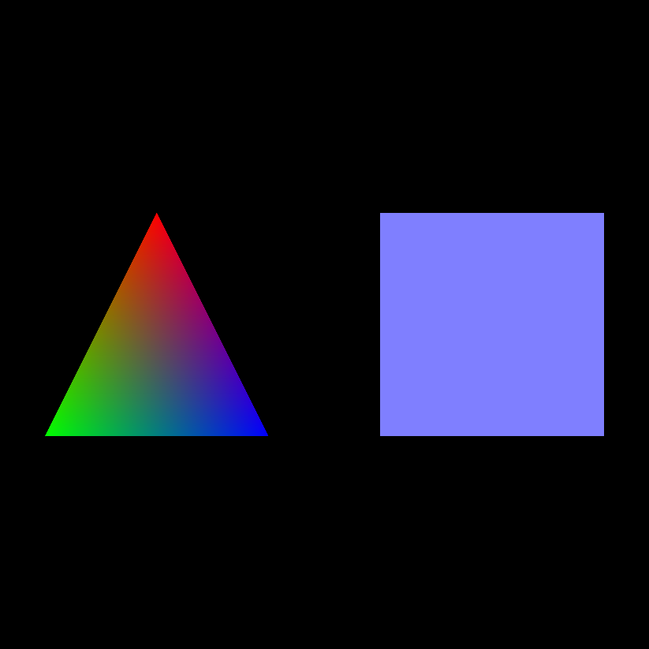
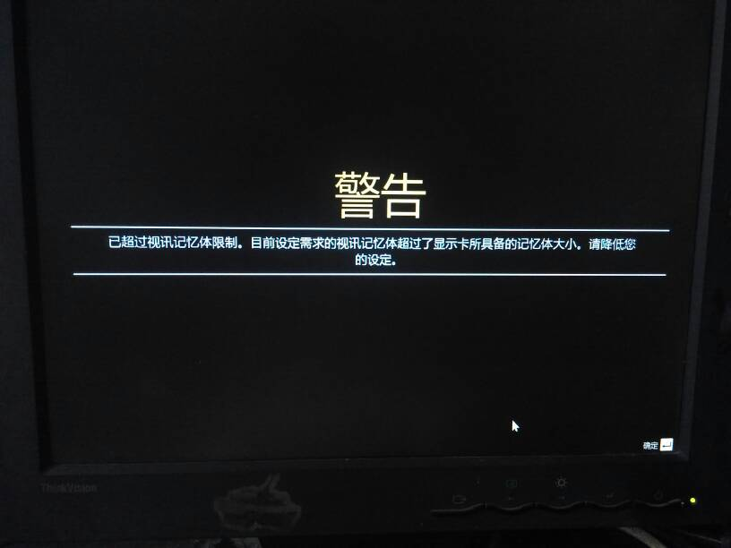

# Lesson2 添加颜色

## 教程说明

欢迎来到 LearningWebGPU 教程，本教程改写自原本的 LearningWebGL.com 的 WebGL 入门教程，而后者则是改编于经典的 Nehe 的 OpenGL 教程。在开始教程前，有一些大家需要知道的事情：

1. 目前 WebGPU 仍然处于草稿阶段，所有的 API 接口可能会在未来发生变化。

2. 目前浏览器对于 WebGPU 的实现和支持仍处于实验阶段，可能会发生一些因为浏览器实现导致的 Bug 或错误；另外，开启浏览器的试验功能可能会降低浏览器的安全性，所以你不应该使用学习 WebGPU 开发的浏览器作为主力浏览器，例如请不要在这个浏览器中浏览、输入个人隐私信息、不要进行网页支付等。

3. 考虑到 WebGPU 正式投入生产环境应该是未来的事情，所以本教程中将会使用大量新的 ECMA Script 的新特性，这些特性可能并不被当下的浏览器和 JavaScript 引擎所支持。

4. 本系列的教程是针对那些已经具备相应编程知识但没有实际 3D 图形经验的人的；目标是让学习者创建并运行代码，并且明白代码其中的含义，从而快速地创建自己的 3D Web 页面。

5. 我编写这套教程是因为我在独立学习 WebGPU，所以教程中可能（非常可能）会有错误，所以还请风险自担。尽管如此，我还是会不断的修正 Bug 和改正其中的错误的，所以如果你发现了教程中的错误或其他任何改进建议，请在本教程的 Github 仓库的 Issue 页面提交。

在这节课中，我们将实现以下效果：



下面让我们开始第 2 课的内容。

在上一节课中我们使用了非常大的篇幅来介绍初始化 WebGPU 过程中遇到的新的概念，例如适配器、硬件、渲染通道、渲染管线等。但在绘制的过程中，我们使用的依然是和 WebGL 中类似的几何体数据资源，例如顶点位置、顶点索引、透视矩阵、变换矩阵等。最终，我们分别绘制出了一个白色的三角形和一个白色的正方形。

在这节课中，我们将为三角和方块增加颜色，尽快白色也是一种颜色，但是它是被我们直接写死在片元着色器代码中的。

```glsl
void main(void) {
  outColor = vec4(1.0, 1.0, 1.0, 1.0);
}
```

在这段代码中，每个顶点的输出颜色是一个固定的四维向量，和我们上节课提到的纹理格式一样，它的四个分量依次是每个顶点的 RGBA 值，我们都赋值为 1.0，也就是白色且不透明的意思。

然而在这节课中，我们希望从 JavaScript 中将颜色值传入 GPU，然后绘制出我们想要的带颜色的图形。

和上一节课的代码相比，我们的 `app.ts` 中的代码并没有结构上的变化，只是为部分函数提供了多个版本的选择：

- `InitPipeline()` 现在提供了一个新版本的函数叫做 `InitPipelineWitMultiBuffers()`。

- `InitGPUBuffer()` 现在提供了一个新版本的函数叫做 `InitGPUBufferWithMultiBuffers()`。

另外，我们在 `main.ts` 中，我们加入了一些新的资源数组，例如 `triangleVertexColor` 和 `squareVertexColor`。

下面，让我们来详细说明一下这些发生变化的代码。不过，在这之前，让我们先来了解一下整个数据的流动过程。

在上一节课的最后一部分，我们介绍了在着色器中几种不同储存类型的变量数据，分别是 `uniform`、`attribute` 和 `varying`（也就是 GLSL 4.5 中的 `in` / `out` 变量）。

让我们试着分析一下，我们在这节课中为了实现添加颜色的目的，应该如何利用这三种变量。

首先， `uniform` 类型的变量是肯定没用的，因为 `uniform` 对于每个像素都是相同的值，而我们可以观察到在上图中，三角形的三个顶点分别是红色、蓝色和绿色。

接下来，`attribute` 似乎是我们需要的类型，因为我们既然可以定义顶点的位置，作为 `attribute`，把数据从 JavaScript 传入 GPU 中，那我们应该可以再定义一个 `attribute` 用于描述顶点的颜色，传给 GPU 处理。

但是有一个问题，我们之前定义的顶点位置，只存在于顶点着色器中，而在顶点着色器中，是不能进行颜色绘制的，我们上面的那段输出最终颜色的代码是位于片元着色器中的。

那如何将数据从顶点着色器传入到片元着色器中呢？

是的，在这里我们就需要用 `varying`，也就是 GLSL 4.5 中 `in` / `out` 变量了。

让我们总结一下整个的数据流程：

1. JavaScript 中准备好顶点位置和顶点颜色数据。

2. 顶点位置和顶点颜色作为 `attribute` 进入顶点着色器。

3. 顶点位置数据留在顶点着色器，用于确定顶点的位置；顶点颜色数据作为输出变量，输出到片元着色器。

4. 片元着色器读取从顶点着色器中传入的顶点颜色，然后输出最终颜色。

好了，以上过程就是我们这节课将要处理的事情。

另外，和上节课的最终绘制结果不同的是，除了我们为三角形的每个顶点都赋予了颜色，同时我们还可以看到，我们在三角形的顶点之间，也就是三角形内部，绘制出了美丽的颜色渐变效果。那这个效果是怎么回事呢？

让我们先不考虑颜色，回到上节课的那个效果，我们需要在屏幕的一个位置绘制一个三角形，而我们输入的仅仅是三角形的三个顶点，同时我们在初始化渲染管线的时候使用 `primitiveTopology: 'triangle-list' 告诉 WebGPU 我们需要绘制三角形。

那么问题来了，三角形三个顶点之间的那些片元或者说像素，是如何被确定下来的？

实时上，WebGPU 在顶点着色器中会按照绘制规则和算法，对顶点的每个属性进行了插值运算。在上节课的过程中，顶点的位置属性按照绘制三角形的算法进行了插值，也就是连接相邻顶点绘制一条直线。类似的，在这节课中，顶点着色器将为每个用于组成三角形的片元进行颜色插值。

这种插值算法是写在 WebGPU 更底层的部分中的，例如 D3D12 这种本地图形接口，或者根据实现不同，甚至有可能直接写在显卡的驱动程序中。

处于 3D 图形应用开发者的位置，一般来说我们是无需关心这一部分插值算法的实现的，所以我们对绘制原理内涵的讨论，暂时先止步于此。

所以，根据上面顶点数据（尤其是顶点颜色）在着色器中的流程讨论，让我们在看 JavaScript 部分之前，先来看看这节课的 GLSL 着色器代码发生哪些变化。

首先是顶点着色器，打开 `shader` 目录下的 `vertex.glsl.ts`。我们可以看到和上节课一样，我们有透视矩阵和变换矩阵两个 `uniform` 变量。

```glsl
layout(binding = 0) uniform Uniforms {

  mat4 uPMatrix;
  mat4 uMVMatrix;

};
```

然后我们接受一个输入变量 `aVertexPosition` 作为顶点位置：

``` glsl
layout(location = 0) in vec3 aVertexPosition;
```

这也和上节课一样。

然后，和上节课不同的是，我们又声明了一个输入变量 `aVertexColor` 作为顶点颜色，它的 `location` 是 `1`：

```glsl
layout(location = 1) in vec4 aVertexColor;
```

接下来，和上节课不同的另一个地方，我们声明了一个输出变量 `vColor`，用于将顶点颜色输出到片元着色器。

```glsl
layout(location = 0) out vec4 vColor;
```

最后，在 `main()` 函数中，我们依然和上节课一样，计算 `gl_Position` 顶点位置，然后我们把接受的输入变量 `aVertexColor` 直接赋值给输出变量 `vColor`，意味着我们将原封不动的将顶点颜色数据传递到片元着色器。

```glsl
void main() {
    gl_Position = uPMatrix * uMVMatrix * vec4(aVertexPosition, 1.0);
    vColor = aVertexColor;
}
```

从目前已知的 WebGPU 标准来看，和 WebGL 类似，在顶点着色器处理完成之后，WebGPU 将会神奇般的将这些由顶点数据描述的 3D 图形转换为 2D 图片，这个过程被称为“**光栅化（Rasterizer）**”；然后为图片中的每个像素调用片元着色器（这就是为什么在有些 3D 图形标准中你会听到他们把片元着色器称为“像素着色器”的原因了）。当然，确切的说是为那些非顶点位置的像素调用片元着色器，而在那些顶点位置上的像素则已经建立好了顶点。这个过程“填充”了各顶点间限定的空间，从而显示出一个可见的形状。片元着色器的作用是返回每个内插点的颜色，并储存在由 `out` 修饰符修饰的变量中。

然后，让我们进入片元着色器。打开 `shader` 目录下的 `fragment.glsl.ts`。

```glsl
#version 450

layout(location = 0) in vec4 vColor;
layout(location = 0) out vec4 outColor;
void main(void) {
  outColor = vColor;
}
```

和上节课不同的是，在这里，我们声明了一个输入变量 `vColor`，用于接收从顶点着色器传入的顶点颜色。

> 注意：你不需要保证片元着色器中的输入变量的变量名和顶点着色器的输出变量的变量名一致。例如在这里，你可以把这里的 `vColor` 命名成任何你想要的名字，而无需和顶点着色器中的 `out vec4 vColor` 保持一致。

然后在 `main()` 函数中，我们又原封不动的将 `vColor` 赋值给输出颜色 `outColor`。

好了，这就是我们用于实现添加颜色的大概过程。让我们接下来看看在 JavaScript 中是如何实现这一数据流动的。

首先，让我们打开 `main.ts`，在描述三角形和方块的顶点信息的数组中，我们多了一部分数据，让我们以三角形为例。

```typescript
const triangleVertex = new Float32Array( [

    // position         // color
    0.0,  1.0,  0.0,    1.0, 0.0, 0.0, 1.0,
   -1.0, -1.0,  0.0,    0.0, 1.0, 0.0, 1.0,
    1.0, -1.0,  0.0,    0.0, 0.0, 1.0, 1.0

] );

const triangleVertexPositon = new Float32Array( [
  
    0.0,  1.0,  0.0, 
   -1.0, -1.0,  0.0, 
    1.0, -1.0,  0.0, 

] );

const triangleVertexColor = new Float32Array( [

    1.0, 0.0, 0.0, 1.0,
    0.0, 1.0, 0.0, 1.0,
    0.0, 0.0, 1.0, 1.0

] );
```

和上节课的内容相比，`triangleVertex` 这个变量中，我们除了记录三角形的三个点的位置信息，还在每个顶点后面加入了 4 个浮点数，用于记录该顶点的颜色信息。

另外两个数组则是各自分别独立储存三角形的顶点位置和顶点颜色信息。

也就是说 `triangleVertexPositon` + `triangleVertexColor` = `triangleVertex`。

这样的两种不同的信息储存方式，都能完整表达顶点数据，对应于我们这节课在 `app.ts` 中提供的同一个函数的两种版本。也就是说，有两种不同的方法，都可以实现本节课的最终效果。这完全取决于你使用的是哪一种信息储存方式和你使用哪一种方式向 GPU 提交数据。

让我们分别来看看这两种方式：

 - 将每个顶点的所有属性合并在一起，用一个 JavaScript 数组表示。也就是 `triangleVertex` 数组的这种方式。每个点的顶点数据需要 3 个浮点数，然后紧跟着是该顶点的颜色数据的 4 个浮点数。如果还有更多的顶点属性，那么就继续跟在后面。通常来说，一个 `GPUBuffer` 对应于一个 JavaScript 中的数组。在这种方式下，我们只需要设定一个 `GPUBuffer` 就可以完整表达所有的顶点属性。让我们把这种模式简称为“单 Buffer 结构”。

 - 将每个顶点的不同属性分开，用多个 JavaScript 数组表示。也就是 `triangleVertexPositon` + `triangleVertexColor` 这种方式。我们在 `triangleVertexPositon` 这个数组中**按顺序**记录每个顶点的位置信息，然后在 `triangleVertexColor` 这个数组中**按相同顺序**记录每个顶点的颜色信息。如果还有更多的顶点属性，那么就再建立一个或多个 JavaScript 数组，按相同顺序记录每个顶点的属性。在这种模式下，我们需要设定多个 `GPUBuffer`。让我们把这种模式简称为“多 Buffer 结构”。

 > 注意：这里的单 Buffer 结构和多 Buffer 结构并非专业的图形学术语，只是本课程为了讲解目的发明的一个简称和代号。

单 Buffer 结构的好处很明显，就是可以只创建一个 `GPUBuffer`。如果创建 `GPUBuffer` 是一个非常损耗性能的过程，那么单 Buffer 结构可以最大程度的降低这一过程的性能损耗。

但是，单 Buffer 结构的坏处也很明显，就是它无法很好的处理数据复用。例如本节课中的正方形，它的四个顶点的颜色都是相同的，如果使用单 Buffer 结构，我们需要将这个颜色值重复写 4 遍。

```typescript
const squareVertex = new Float32Array( [

    // position         // color
     1.0,  1.0,  0.0,   0.5, 0.5, 1.0, 1.0,
    -1.0,  1.0,  0.0,   0.5, 0.5, 1.0, 1.0,
     1.0, -1.0,  0.0,   0.5, 0.5, 1.0, 1.0,
    -1.0, -1.0,  0.0,   0.5, 0.5, 1.0, 1.0

] );
```

还好是个正方形，只有 4 个顶点；如果有 800 个顶点，恐怕我们得重复写 800 次。

也许你会说，我们可以写一个类似于 `mergeVertexAttributes()` 的函数，把所有的顶点属性用一个 `for` 循环都整合在一起。但是对于复杂的应用来说，你无法避免的是，这种方式会显著的提高 CPU 和 GPU 内存的占用，这才是让人无法忍受的诟病所在。要知道，在这个 CPU 内存已经普遍达到 8GB 或者 16GB 甚至 32GB 的时代，GPU 内存的容量依然很低，很多 GPU 显存的容量只有 2GB 或者 4GB，甚至更低，在移动设备和集成显卡中，还需要与 CPU 共享内存。所以，降低显存占用是 3D 图形应用开发中一个非常重要的性能优化手段。


*图为在游戏 GTA5 中，当图形性能超出显卡显存时的提示，俗称为“爆显存”*

因此，你可以在 `main.ts` 的代码中看到，这个 `squareVertex` 数组在声明后并没有使用，，也就是说我们对于正方形的绘制并没有使用这种单 Buffer 结构。

相反，我们将正方形的顶点颜色记录到了另外一个数组中，并且只记录了一遍顶点颜色。

```typescript
const squareVertexColor = new Float32Array( [

    0.5, 0.5, 1.0, 1.0

] );
```

所以，在这节课中，对于三个顶点颜色各不相同的三角形，我们将使用单 Buffer 结构绘制；对于四个顶点颜色完全相同的正方形，我们将使用多 Buffer 结构绘制。

下面，让我们进入 `app.ts` 来看看如何实现这两种不同的结构。

首先是单 Buffer 结构，因为并没有增加新的 `GPUBuffer`，所以我们依然可以继续使用上节课中的大部分代码。只是在初始化渲染管线的地方，为 `vertexBuffers` 中的那个 `GPUBuffer` 增加一个新的 `attribute`。找到 `InitPipeline()` 函数的代码，你会看到如下内容：

```typescript
                vertexBuffers: [ {

                    arrayStride: 4 * ( 3 + 4 ),

                    attributes: [

                        // position

                        {

                            shaderLocation: 0,

                            offset: 0,

                            format: 'float3'

                        },

                        // color

                        {

                            shaderLocation: 1,

                            offset: 4 * 3,

                            format: 'float4'

                        }

                    ]

                } ]
```

在这里你可以发现，`vertexBuffers` 是一个数组，由于我们使用的是单 Buffer 结构，所以在这个数组中我们只写了一个成员；但是和上节课不同的是，我们在这个成员的 `attributes` 数组字段中，新增了一个成员，用于顶点颜色。

```typescript
                        // color

                        {

                            shaderLocation: 1,

                            offset: 4 * 3,

                            format: 'float4'

                        }
```

- `shaderLocation` 是 1，对应于顶点着色器的 GLSL 代码中的 `layout(location = 1) in vec4 aVertexColor;`。

- `offset` 用于描述从这个 GPUBuffer 的第多少个 Byte 开始读取，因为是颜色是排在位置后面，而位置需要用 3 个 32 位浮点数描述，每个 32 位浮点数需要 4 个 Byte 表示，所以 `offset` 是 `4 * 3`。

- 我们用 4 个浮点数描述颜色信息，所以 `format` 是 `'float4'`。

最后，因为增加了颜色信息，所以现在我们要用 7 个浮点数来描述一个顶点，于是这个 GPUBuffer 的 `arrayStride` 变成了 `4 * ( 3 + 4 )`。

因为只使用了一个 `GPUBuffer`，所以我们的 `InitGPUBuffer()` 函数和上节课相比，没有发生任何变化。

这样，我们就完成了单 Buffer 结构的数据流程。总结来说，就是**单个 `GPUBuffer`，多个 `attribute`**。

下面我们来看下多 Buffer 结构的写法，因为使用了多个 `GPUBuffer` 我们的初始化渲染管线和初始化 `GPUBuffer` 的代码都发生了变化。让我们先来看看 `InitPipelineWitMultiBuffers()` 函数的代码。

```typescript
                vertexBuffers: [ 
                    
                    {

                        arrayStride: 4 * 3,

                        attributes: [

                            // position

                            {

                                shaderLocation: 0,

                                offset: 0,

                                format: 'float3'

                            }

                        ],

                        stepMode: 'vertex'

                    },

                    {

                        arrayStride: 4 * 4,

                        attributes: [

                            // color

                            {

                                shaderLocation: 1,

                                offset: 0,

                                format: 'float4'

                            }

                        ],

                        stepMode: 'instance'

                    },

                ]

```

你可以看到，我们在 `vertexBuffers` 字段中新增加了一个数组成员用于顶点颜色，和顶点位置一样，设置了它的各个参数，并使用 `shaderLocation` 和顶点着色器中的 GLSL 代码对应；并且我们设置其 `stepMode` 为 `'instance'`，代表我们每个实例调用一次这个 Buffer，也就是说这个实例的所有顶点都使用相同的颜色属性。

然后是初始化 `GPUBuffer` 的 `InitGPUBufferWithMultiBuffers()` 函数。

```typescript
        let colorBuffer = this._CreateGPUBuffer( colorArray, GPUBufferUsage.VERTEX );

        this.renderPassEncoder.setVertexBuffer( 1, colorBuffer, 0 );
```

可以看到，我们创建了一个独立的 `GPUBuffer` 用于储存顶点颜色数据，然后绑定到当前的渲染通道上，把顶点颜色数组传递给 GPU。

这样我们就完成多 Buffer 结构的数据传递。总的来说，就是**多个 `GPUBuffer`，每个 `GPUBuffer` 只有一个 `attribute`**。

最后，让我们再回到上层逻辑的 `main.ts` 中。

```typescript
    app.InitPipeline( vxCode, fxCode );

    app.InitGPUBuffer( triangleVertex, triangleIndex, triangleUniformBufferView );

    app.Draw( triangleIndex.length );

    app.InitPipelineWitMultiBuffers( vxCode, fxCode );

    app.InitGPUBufferWithMultiBuffers( squareVertexPosition, squareVertexColor, squareIndex, squareUniformBufferView );

    app.Draw( squareIndex.length );
```

在这里，我们先使用单 Buffer 结构的方式初始化了渲染管线和 `GPUBuffer`，绘制了三角形；然后又使用多 Buffer 结构的方式重新初始化渲染管线和 `GPUBuffer`，绘制了正方形。

好了，以上就是本节课的代码讲解部分。

最后做下总结：

- 你有两种方式可以处理顶点信息，一种是把一个顶点的所有属性都合并在一起，使用一个 JavaScript 数组表达；另一种是把一个顶点的各种属性分开，用多个 JavaScript 数组表达。这完全取决于你的 3D 美术资产的管理组织方式。

- 你有两种方式可以向 GPU 传递顶点数据，一种是使用一个 `GPUBuffer`，这个 `GPUBuffer` 包含多个 `attribute`；另一种是使用多个 `GPUBuffer`，每个 `GPUBuffer` 只包含一个 `attribute`。这完全取决于你的顶点属性的复用性程度。

- 另外，你当然也可以使用多个 `GPUBuffer`，每个 `GPUBuffer` 包含一个或多个 `attribute`。这完全取决于你的 3D 应用的具体需求。

好了，以上就是本节课的全部内容。

