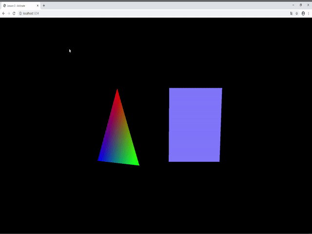

# Lesson3 动起来

## 教程说明

欢迎来到 LearningWebGPU 教程，本教程改写自原本的 LearningWebGL.com 的 WebGL 入门教程，而后者则是改编于经典的 Nehe 的 OpenGL 教程。在开始教程前，有一些大家需要知道的事情：

1. 目前 WebGPU 仍然处于草稿阶段，所有的 API 接口可能会在未来发生变化。

2. 目前浏览器对于 WebGPU 的实现和支持仍处于实验阶段，可能会发生一些因为浏览器实现导致的 Bug 或错误；另外，开启浏览器的试验功能可能会降低浏览器的安全性，所以你不应该使用学习 WebGPU 开发的浏览器作为主力浏览器，例如请不要在这个浏览器中浏览、输入个人隐私信息、不要进行网页支付等。

3. 考虑到 WebGPU 正式投入生产环境应该是数年后的事情，所以本教程中将会使用大量新的 ECMA Script 的新特性，这些特性可能并不被当下的浏览器和 JavaScript 引擎所支持。

4. 本系列的教程是针对那些已经具备相应编程知识但没有实际 3D 图形经验的人的；目标是让学习者创建并运行代码，并且明白代码其中的含义，从而快速地创建自己的 3D Web 页面。

5. 我编写这套教程是因为我在独立学习 WebGPU，所以教程中可能（非常可能）会有错误，所以还请风险自担。尽管如此，我还是会不断的修正 Bug 和改正其中的错误的，所以如果你发现了教程中的错误或其他任何改进建议，请在本教程的 Github 仓库的 Issue 页面提交。

在这节课中，我们将实现以下效果：



下面让我们开始第 3 课的内容。

在前面的课程中，我们基本上可以通过所学的知识，在屏幕上绘制出简单图形了；但是，它们都是静止不动的图形。原因在于，我们在代码中只渲染了 1 帧图形。

```typescript
    app.Draw( squareIndex.length );

    app.Present();
```

可以看到，我们执行了绘制和呈现命令后，WebGPU 将我们绘制的图形呈现在屏幕上，但是同时代码也终止于此。那么，如何才能让绘制的图形动起来呢？

首先，在 WebGPU 中绘制运动图形的原理和在 WebGL 中是一样的，就是不断重复绘制那个图形，在每次绘制中，都稍微改变一下图形的某个属性，例如位置、旋转、缩放等等。

和大多数图形底层框架一样，WebGPU 并没有提供一个高级的循环渲染接口，因此我们需要借助于 JavaScript 和浏览器环境中的相关 API 来实现循环渲染。

这就是大家熟知的 `window.requestAnimationFrame()`。在本教程的早期版本中，仍需解释为何使用这个 API 而不是 JavaScript 中的 `setInterval()`，但相信在 2020 年的版本中，读者一定都已经熟知其中的原因了。顺便说一句，在 `requestAnimationFrame()` 出现前，大概是 10 年前左右，WebGL 程序的确是使用 `setInterval()` 来循环渲染的。

让我们看一下本课的 `app.ts`，我们为 `App` 类新增了一个名为 `RunRenderLoop()` 的方法，在这个函数中，我们接受一个函数作为参数，并执行这个函数，然后调用 `requestAnimationFrame()` 来进行循环渲染。

```typescript
    public RunRenderLoop( fn: Function ) {

        fn();

        requestAnimationFrame( () => this.RunRenderLoop( fn ) );

    }
```

接下来，我们来看看 `main.ts` 中的代码，这也是我们在 HTML 网页中执行的主程序。在这里，我们新增了一个名为 `animate()` 的函数。

```typescript
    let lastTime = 0, rTri = 0, rSquare = 0;
 
    let animate = () => {

        let timeNow = performance.now();

        if ( lastTime != 0 ) {

            let elapsed = timeNow - lastTime;
 
            rTri += ( Math.PI / 180 * 90 * elapsed ) / 1000.0;

            rSquare += ( Math.PI / 180 * 75 * elapsed ) / 1000.0;

        }

        lastTime = timeNow;
    }
```

我们在这里基本就是计算了一个时间差，并根据时间差计算出在这段时间间隔内图形的运动量。这样做的好处就是，无论在性能如何的电脑上，图形在单位时间内的运动量都会保持一致。


